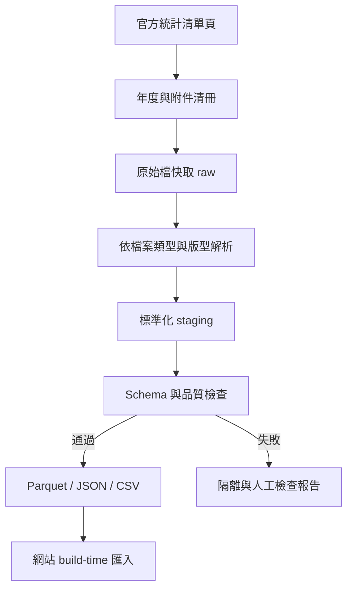

# 大考中心統計資料探勘互動網站｜Codex 開發計畫書

> 文件版本：v1.0  
> 建立日期：2026-08-23  
> 專案定位：將大考中心歷年公開統計資料轉為可查詢、可比較、可驗證、可下載的互動式資料探勘網站  
> 主要語言：繁體中文（臺灣用語）  
> 本文件可直接貼給 Codex 作為專案規格與執行指令。

---

## 0. 給 Codex 的總指令

你是本專案的資深全端工程師、資料工程師與教育測量資料分析師。請依本計畫書建立一個可實際執行、可部署、可測試的大考中心統計資料探勘互動網站。

執行時必須遵守：

1. 先檢查目前 repository、既有技術與 `AGENTS.md`，不要無故重建已有功能。
2. 先完成資料盤點與最小可行資料集，再做 UI；不可先用假資料把畫面做滿。
3. 官方資料一律保留來源網址、下載日期、檔案雜湊、原始檔名與解析狀態。
4. 不得把不同考試制度、科目尺度、級分制度或母群體直接混算。
5. 圖表與結論必須能追溯到原始資料；不得生成沒有資料依據的推論。
6. 網站所有文字使用繁體中文與臺灣慣用語；民國年與西元年可切換或並列。
7. 優先做靜態可部署架構；資料擷取與清理在 build time 執行，不讓瀏覽器即時爬大考中心。
8. 每一階段完成後執行型別檢查、測試、build 與基本無障礙檢查，修正後才進入下一階段。
9. 不繞過大考中心的存取限制；設定合理速率、快取與重試，避免重複下載。
10. 不宣稱本網站為大考中心官方網站，頁尾清楚標示資料來源與免責聲明。

---

## 1. 專案願景

大考中心目前以「年度頁面＋多個 Excel／PDF 檔案」發布統計資料，適合逐檔查閱，但不方便：

- 快速比較跨年度趨勢；
- 查看某科各級分分布的改變；
- 比較不同科目、考試或選考組合；
- 從題目答對率、鑑別度與選項分布找出命題特徵；
- 追蹤報名、到考、缺考及選考行為；
- 讓教師、考生、家長與研究者下載已整理的 tidy data；
- 釐清制度變動前後何者可比、何者不可比。

本專案要建立一個「資料來源透明、制度差異說清楚、互動分析容易操作」的公共教育資料入口。

建議名稱：**大考資料洞察 CEEC Data Explorer**。

---

## 2. 官方資料範圍（初步盤點）

### 2.1 核心來源

- 學測統計資料首頁：<https://www.ceec.edu.tw/xmdoc?xsmsid=0J018604485538810196>
- 分科測驗（110 前為指定科目考試）統計首頁：<https://www.ceec.edu.tw/xmdoc?xsmsid=0J018611000723433352>
- 高中英語聽力測驗統計首頁：<https://www.ceec.edu.tw/xmdoc?xsmsid=0J018576409065359986>
- 115 學年度學測統計圖表範例頁：<https://www.ceec.edu.tw/xmdoc/cont?sid=0Q056289672991900264&xsmsid=0J018604485538810196>

### 2.2 已確認的時間範圍

| 考試類型 | 官方清單筆數 | 初步年度範圍 | 重要制度斷點 |
|---|---:|---|---|
| 學科能力測驗 | 28 筆 | 83–115 學年度，另有歷年報名統計 | 99 課綱、108 課綱、111 學年度新制、科目與級分尺度變化 |
| 分科／指定科目考試 | 26 筆 | 最新至 115，舊制資料回溯多年度 | 111 學年度由指考轉為分科測驗；採計科目與成績表示改變 |
| 高中英語聽力測驗 | 31 筆 | 最新至 115，含每學年度第一次、第二次 | 場次、等級分布與報名母群差異 |

### 2.3 最新學測年度可取得的資料類型

1. 考生基本資料
   - 報名人數統計總表
   - 各考區、分區與試場考生人數
   - 各選考組合報名人數
   - 缺考人數
   - 各集報學校報名人數
2. 成績統計
   - 原得總分與級分對照
   - 各科級分人數、百分比與累計百分比
   - 2–4 科不同科目組合級分人數百分比累計
   - 各科級分分布圖
   - 各科成績標準（頂標、前標、均標、後標、底標）
3. 非選擇題閱卷
   - 國寫及英文非選擇題題分、第三閱差分
   - 國寫分數人數分布
   - 英文非選擇題分數人數分布
4. 試題品質
   - 各科試題答對率與鑑別度分布
   - 各題答對率與鑑別度
   - 各科選擇題選項分析

### 2.4 檔案格式風險

最新年度多數表格仍為 `.xls`。不同年度可能出現 `.xls`、`.xlsx`、`.pdf`、合併儲存格、多列標題、註腳、空白列、科目改名與欄位順序不同。解析器不能假設所有年份共用同一版型。

---

## 3. 目標使用者與核心任務

| 使用者 | 想完成的任務 |
|---|---|
| 高中教師／輔導教師 | 看歷年五標、級分分布、考生選科與試題難度變化 |
| 考生／家長 | 查個人成績在當年度的大致位置、比較科目與年度，但不做錄取保證 |
| 補教／命題教師 | 分析題目難度、鑑別度、誘答選項與非選題分布 |
| 教育研究者 | 下載結構化資料、重現圖表、檢視資料來源及制度註記 |
| 一般讀者／媒體 | 快速得到報考趨勢、五標變化與重點摘要 |

---

## 4. MVP 與完整版本範圍

### 4.1 MVP（第一個可上線版本）

- 納入學測 111–115 學年度。
- 自動建立來源清單並下載官方 `.xls/.xlsx`。
- 完成報名／缺考、五標、各科級分分布、原始分數—級分對照。
- 建立總覽、歷年趨勢、級分分布、個人成績定位、資料下載五個頁面。
- 每張圖顯示資料來源、資料年度、更新時間與制度註記。
- 可下載目前篩選結果 CSV 與圖表 PNG/SVG。
- 有 parser fixture、schema validation、關鍵計算測試與資料品質報告。

### 4.2 第二階段

- 擴充學測至 83–110 學年度。
- 加入 2–4 科組合累計分布。
- 加入分科測驗 111–115 學年度。
- 加入答對率、鑑別度與選項分析。
- 加入年度比較、科目比較與試題散佈圖。

### 4.3 第三階段

- 擴充舊指考與英聽歷年資料。
- 加入非選擇題、國寫與英文作文分析。
- 加入可分享的查詢網址、資料 API、研究者下載包。
- 建立排程式來源更新檢查與資料差異報告。

### 4.4 明確不做

- 不蒐集考生姓名、准考證號或其他個資。
- 不把公開群體統計偽裝成個人錄取機率。
- 不推算官方未提供的校系錄取門檻。
- 不以圖表影像 OCR 作為有表格檔時的主要資料來源。
- 不即時高頻爬取官方網站。

---

## 5. 研究問題與 Data Mining 模組

### A. 報考行為

- 報名人數、到考人數、缺考率歷年趨勢。
- 各科選考率如何變化？
- 選考組合集中度是否上升？可計算 HHI 與熵值，但必須解釋公式。
- 不同考區、集報學校或場次的結構變化（僅在資料欄位跨年一致時比較）。

### B. 成績分布

- 各科各級分人數與比例。
- 累計百分比、PR 對照與分位數位置。
- 五標歷年趨勢與年度差。
- 原始分數轉級分門檻、每一級分區間寬度。
- 分布偏態、集中度、天花板／地板效應。

### C. 跨科與組合分析

- 科目組合總級分的累計人數與比例。
- 使用者輸入多科成績後，依官方組合累計表定位。
- 若官方只提供累計分布，不得反推出未公開的個體科目相關係數。
- 不用各科邊際分布相乘假設科目獨立。

### D. 試題分析

- 題目答對率（難度）分布。
- 鑑別度分布與低鑑別題標記。
- 答對率 × 鑑別度散佈圖，依科目、題型、題號篩選。
- 選項分析：正答率、各誘答選項比例、未作答率。
- 可定義「需留意題目」規則，但預設門檻必須可調且不得宣稱等同官方判定。

### E. 制度前後比較

- 以制度分段呈現，不畫一條誤導性的無縫長期趨勢線。
- 顯示科目、滿分、級分尺度、考試用途或母群改變的事件標記。
- 提供「僅顯示可比年度」開關。
- 不同尺度可改顯示百分位或標準化指標，但須註明是網站衍生值。

### F. 個人成績定位（非預測）

- 輸入年度、考試、科目及級分／分數。
- 回傳該分數人數、百分比、累計百分比、約略 PR 區間與五標位置。
- 若同分者很多，以區間呈現，不給假精確的單一名次。
- 清楚標示「群體統計定位，不代表校系錄取結果」。

---

## 6. 資料擷取與 ETL 架構

### 6.1 資料流程



### 6.2 建議目錄

```text
data/
  catalog/              # 官方頁面、年度、附件與 metadata 清冊
  raw/                  # 原始下載檔，不手動修改
  staging/              # 解析後、尚未完全標準化
  processed/            # 前端與研究下載使用的資料
  quality/              # 驗證、缺漏、差異與解析報告
scripts/
  discover/             # 掃描清單頁與年度頁
  download/             # 節流、重試、雜湊、快取
  parsers/              # 依資料類型／年度版型拆分
  transform/            # 正規化與衍生欄位
  validate/             # schema 與數值關係檢查
src/
  app/                  # 頁面
  components/           # 篩選器、表格、圖表、來源卡
  lib/                  # query、format、methodology
tests/
  fixtures/             # 小型去識別原始檔樣本
  parsers/
  calculations/
  e2e/
```

### 6.3 來源清冊 `sources.json` 最低欄位

```json
{
  "source_id": "gsat-115-score-distribution",
  "exam": "GSAT",
  "academic_year": 115,
  "regime_id": "GSAT_111_PLUS",
  "category": "score_distribution",
  "title": "各科級分人數百分比累計表",
  "landing_page_url": "...",
  "download_url": "...",
  "original_filename": "...xls",
  "mime_type": "application/vnd.ms-excel",
  "downloaded_at": "ISO-8601",
  "sha256": "...",
  "parser_id": "gsat_score_distribution_v3",
  "parse_status": "success",
  "license_note": "資料來源：大學入學考試中心"
}
```

### 6.4 擷取規則

- 使用明確 User-Agent 與聯絡資訊（若專案有公開聯絡方式）。
- 每次請求至少間隔 1–2 秒，遇 429／5xx 指數退避。
- 同 URL 且雜湊未變不重複處理。
- 保留原始檔，不在 raw 層轉存覆蓋。
- URL、檔名、MIME 與副檔名不一致時，以實際內容偵測，但記錄警告。
- 清單消失或檔案更新時產生 diff，不直接刪除舊版本。
- 正式環境只讀取專案內的 processed artifacts，不跨來源 CORS 即時抓取。

### 6.5 Excel 解析策略

- Python 建議：`pandas`、`openpyxl`、`xlrd`（只用於舊 `.xls`，固定相容版本）、必要時 `python-calamine`。
- 先偵測工作表、有效資料區、合併儲存格、多列標題與註腳。
- 不以固定列號作唯一定位；優先使用標題關鍵字＋欄位型態＋總計列驗證。
- 每類資料建立獨立 parser adapter；禁止把所有 Excel 塞進單一巨型 parser。
- 百分比保留足夠精度，顯示時才格式化。
- `—`、空白、`*`、`<5` 等值不可一律轉成 0；需使用缺失原因欄位。

---

## 7. 正規化資料模型

### 7.1 維度表

| 表 | 主要欄位 |
|---|---|
| `dim_exam` | `exam_id`, `name_zh`, `exam_family` |
| `dim_regime` | `regime_id`, `start_year`, `end_year`, `score_scale`, `comparability_note` |
| `dim_year` | `academic_year`, `gregorian_year`, `display_label` |
| `dim_subject` | `subject_id`, `canonical_name`, `source_name`, `subject_group` |
| `dim_source` | 來源 URL、檔案、雜湊、更新日、parser、品質狀態 |
| `dim_item` | 科目、題號、題型、正確選項（僅官方有提供時） |

### 7.2 事實表

| 表 | Grain（每列代表） | 核心欄位 |
|---|---|---|
| `fact_registration` | 年度 × 考試 × 群組 | 報名、到考、缺考、人數、比率 |
| `fact_subject_selection` | 年度 × 科目／組合 | 報名人數、占比 |
| `fact_score_boundary` | 年度 × 科目 × 級分 | 原始分數下限／上限 |
| `fact_score_distribution` | 年度 × 科目 × 級分 | 人數、比例、累計人數、累計比例 |
| `fact_standard` | 年度 × 科目 × 標準 | 頂／前／均／後／底標級分 |
| `fact_combo_distribution` | 年度 × 科目組合 × 總級分 | 人數、比例、累計比例 |
| `fact_item_metric` | 年度 × 科目 × 題號 | 答對率、鑑別度、未答率 |
| `fact_option_distribution` | 年度 × 科目 × 題號 × 選項 | 選項人數／比例、是否正答 |
| `fact_constructed_response` | 年度 × 科目 × 題型 × 分數 | 人數、比例、第三閱資訊 |

### 7.3 衍生值標記

所有非官方直接欄位加入：

- `is_derived: true`
- `derivation_method`
- `derivation_version`
- `input_source_ids[]`

例如 PR 區間、HHI、熵值、年增率與標準化分數都必須可重算。

---

## 8. 資料品質與統計驗證

最低自動檢核：

1. 人數不得為負數；百分比原則上介於 0–100。
2. 累計人數與累計百分比必須具單調性；方向依官方表定義。
3. 各級分人數合計應與有效成績人數一致；容許差異必須有註腳或原因。
4. 選項比例合計應約為 100%，納入未作答或多重作答定義。
5. 五標應符合該制度下合理順序；異常只標記，不擅自改值。
6. 原始分數級分區間不得重疊，除非官方定義如此且有註記。
7. 同一 `source_id + sheet + row locator` 不得重複匯入。
8. 與官方總計列進行 reconciliation，輸出差額。
9. 新年度 schema drift 必須讓 CI 失敗或進入 quarantine，不得默默略過欄位。
10. processed 資料每列必須能關聯 `source_id`。

品質頁面至少顯示：涵蓋年度、來源檔數、成功／警告／失敗數、最後更新、各資料集缺漏矩陣。

---

## 9. 網站資訊架構與功能規格

### 9.1 首頁／資料總覽

- KPI：最新年度報名人數、到考人數、缺考率、資料涵蓋年數、科目數。
- 考試切換：學測、分科／指考、英聽。
- 年度範圍與制度時間軸。
- 最新年度重點卡片，但不自動生成因果解釋。
- 資料完整度矩陣與更新狀態。

### 9.2 歷年趨勢

- 指標：報名、到考、缺考率、選考率、五標、級分門檻。
- 多科比較與單科詳細模式。
- 折線圖上標出制度斷點，預設不跨斷點連線。
- 年度差、百分比差與 CAGR 僅在統計上合理時提供。
- 圖下同步顯示可排序資料表。

### 9.3 級分分布探索

- 長條圖／階梯累計圖切換。
- 年度、科目、級分範圍、顯示人數／比例切換。
- 兩年度 overlay 或 small multiples，比較時保留相同座標尺度。
- hover 顯示人數、占比、累計占比、來源。
- 五標參考線。

### 9.4 多科組合分析

- 選 2–4 科與年度。
- 顯示官方組合累計表中可用組合；沒有官方資料就明確停用。
- 輸入總級分後回傳累計位置與同分區間。
- 不用邊際分布拼出虛構的聯合分布。

### 9.5 個人成績定位

- 本機瀏覽器運算，不儲存輸入成績。
- 支援單科及官方已有的多科組合。
- 顯示五標帶、PR 區間、同級分人數、累計百分比。
- 可複製分享摘要，但 URL 預設不放個人成績；需使用者主動開啟才產生分享參數。

### 9.6 試題品質實驗室

- 答對率 × 鑑別度散佈圖。
- 邊際直方圖、象限／可調門檻、題目清單連動。
- 點題號後顯示各選項比例。
- 用中性詞「需進一步檢視」，不要僅憑門檻判定「壞題」。

### 9.7 資料目錄與下載

- 依考試、年度、資料類型、格式、狀態搜尋。
- 顯示官方原始檔與網站整理檔的區別。
- 下載 CSV／JSON／Parquet（研究版可後做）。
- 顯示欄位字典、資料粒度、缺失值定義、授權與引用方式。

### 9.8 方法與限制

- 制度沿革與比較矩陣。
- 五標、級分、累計比例、PR 區間、鑑別度的白話說明。
- 資料來源、處理方法、版本紀錄、已知缺漏。
- 明確區分「官方值」與「本站計算值」。

---

## 10. 互動與視覺設計

- Desktop first 但完整支援手機；主要斷點 375、768、1280 px。
- 全站共用 sticky filter bar：考試、制度、年度、科目。
- 篩選狀態寫入 query string，便於重現分析。
- 預設色彩不把科目只用紅綠區分；符合 WCAG AA。
- 圖表必須有文字摘要、資料表替代、鍵盤操作與清楚 focus state。
- 數字使用臺灣千分位；百分比預設 1–2 位小數；不得顯示超過資料精度的位數。
- 民國年作主標示，可輔以西元年。
- 空狀態要說明「沒有官方資料」「尚未解析」或「此制度不可比」，不可只顯示空白。
- 所有圖表提供來源抽屜：官方標題、年度頁、原始檔、下載日、處理版本。

---

## 11. 建議技術架構

### 11.1 前端

- Next.js（App Router）＋ TypeScript。
- Tailwind CSS；元件可用 shadcn/ui，但維持一致設計系統。
- Apache ECharts 或 Observable Plot：選一個主圖表庫，避免多套混用。
- TanStack Table：大型可篩選資料表。
- Zod：前端資料契約驗證。
- URL query state 使用原生 `searchParams` 或 nuqs。

若 repository 已使用 Vite／React 且運作良好，保留現有架構，不為追求上述清單強制改框架。

### 11.2 資料處理

- Python 3.12。
- pandas／Polars 擇一為主要轉換層；大量跨年合併可優先 Polars。
- Pandera 或 Pydantic 驗證 schema。
- PyArrow 輸出 Parquet。
- pytest 測 parser 與計算。

### 11.3 部署

- 前端可部署 Vercel。
- processed 資料若小於合理 bundle 大小，使用壓縮 JSON／Arrow 靜態檔。
- 大型資料採按考試／年度／模組切片 lazy load，不一次下載全部。
- ETL 以 GitHub Actions 手動＋排程執行；更新後開 PR，人工檢查品質報告再合併。
- 不把 raw 大檔全部塞進前端 public；可用 Git LFS、release asset 或獨立 artifact 策略。

---

## 12. API／前端資料契約（建議）

```text
/data/manifest.json
/data/{exam}/years.json
/data/{exam}/{year}/overview.json
/data/{exam}/{year}/score-distribution.json
/data/{exam}/{year}/standards.json
/data/{exam}/{year}/score-boundaries.json
/data/{exam}/{year}/combinations/{combo}.json
/data/{exam}/{year}/items/{subject}.json
```

每份 JSON 包含：

```json
{
  "schema_version": "1.0.0",
  "generated_at": "ISO-8601",
  "source_ids": ["..."],
  "data": [],
  "notes": [],
  "quality": { "status": "passed", "warnings": [] }
}
```

---

## 13. 測試與驗收標準

### 13.1 資料層

- 每個 parser 至少有一個真實版型 fixture 與 snapshot／expected rows。
- 111–115 學測四類 MVP 資料解析成功率 100%。
- 官方總計 reconciliation 無未解釋差異。
- 重跑 ETL 具 deterministic output；時間欄位除外。
- 已下載檔未變時，不產生無意義 diff。

### 13.2 計算層

- PR 區間、累計方向、五標分類與同分處理有邊界測試。
- 百分比顯示與底層精度分離。
- 跨制度不可比規則有測試，不能被 UI query 繞過。

### 13.3 前端

- 首頁、趨勢、分布、定位、下載頁可在手機與桌機正常使用。
- 所有主要篩選能用鍵盤操作。
- URL 可重現目前篩選狀態。
- 圖表切換後資料表同步更新。
- 無資料、錯誤、載入中都有明確狀態。
- Lighthouse 建議門檻：Performance ≥ 85、Accessibility ≥ 95、Best Practices ≥ 90。

### 13.4 E2E 核心情境

1. 使用者選 115 學測國文，可看到級分分布、五標與來源。
2. 使用者比較 111–115 英文五標，可看到制度範圍與年度數值。
3. 使用者輸入單科級分，可得到正確累計位置與同分區間。
4. 使用者嘗試跨不可比制度比較，網站顯示警告並改用分段圖。
5. 使用者下載篩選後 CSV，列數與畫面資料一致。
6. 原始來源缺失時，不顯示捏造資料，並提供品質狀態。

---

## 14. 分階段實作工作單

### Phase 0｜Repository 與來源稽核

- 檢查現有 repo、套件、測試與部署設定。
- 建立 `docs/data-source-audit.md`，列出三類考試清單頁、年度、附件、格式與風險。
- 實測下載至少 115、114、111 三個學測年度的附件。
- 提出最終 schema 與 parser 分群，不做 UI。

**完成條件：** `sources.json` 有可重現來源清冊，並確認 `.xls` 解析方案。

### Phase 1｜MVP ETL

- 實作 discover、download、parse、transform、validate CLI。
- 完成 111–115 學測：報名／缺考、五標、級分分布、分數級分對照。
- 產出 processed JSON／CSV、資料字典與品質報告。
- 加入 pytest、schema validation。

**完成條件：** `make data` 或單一 npm task 可完整重建資料；測試通過。

### Phase 2｜網站骨架與總覽

- 建立共用 layout、篩選器、來源卡、錯誤與空狀態。
- 完成首頁、資料目錄、方法頁。
- 先用真實 processed data，禁止使用隨機假資料。

### Phase 3｜核心互動分析

- 完成歷年趨勢、級分分布、個人成績定位。
- URL state、下載、圖表替代表格、響應式與無障礙。
- 撰寫計算單元測試與 Playwright E2E。

### Phase 4｜進階 Data Mining

- 加入多科組合分布、題目答對率／鑑別度、選項分析。
- 加入制度斷點比較規則、衍生指標說明與可調門檻。

### Phase 5｜自動更新與發布

- 建立排程更新檢查、來源 diff、品質 gate 與人工核准流程。
- 完成 SEO、Open Graph、robots、sitemap、效能與安全檢查。
- 部署 production，記錄發布版本與資料版本。

---

## 15. Codex 每階段回報格式

每完成一個 Phase，請回報：

1. 完成項目。
2. 新增／修改的主要檔案。
3. 實際納入的官方資料與年度。
4. 測試命令及結果。
5. 資料品質警告與尚未解析項目。
6. 畫面或 preview URL（若已有）。
7. 下一階段建議。

若遇到官方格式差異，不要靜默套用錯誤欄位；先保存失敗 fixture、寫明原因，再新增針對性 parser。

---

## 16. 分析倫理、限制與免責

- 大考中心資料為群體統計；不能由此識別或推估個別考生身分。
- PR 與累計百分比遇同分群體時只能合理表示區間。
- 不同年度的報考人口、課綱、考科與尺度可能不同；相關不等於因果。
- 五標是當年度分布位置指標，不等同考題絕對難度，也不等同校系錄取標準。
- 答對率及鑑別度受考生群體與計分方式影響，需搭配官方定義閱讀。
- 本站所有衍生分析須公開公式與版本；錯誤可回報並追蹤修正。
- 建議頁尾文字：  
  「本網站為非官方資料整理與視覺化專案。原始統計資料來源為大學入學考試中心；實際定義與數值請以官方公告為準。」

---

## 17. 建議第一輪立即執行指令

將本文件交給 Codex 後，先下達：

> 請先只執行 Phase 0 與 Phase 1，不要急著做完整 UI。檢查 repository 後，建立官方來源清冊，實際下載並解析 111–115 學測的「報名／缺考、五標、各科級分人數百分比累計、原得總分與級分對照」資料。建立可重跑 ETL、schema、資料字典、品質報告與測試。完成後先回報資料涵蓋率、格式差異、解析失敗與檔案變更，再等我確認進入 Phase 2。

---

## 18. 專案成功指標

- 使用者在 30 秒內完成「選年度／科目 → 看分布與五標 → 找來源」。
- 任一畫面數值最多兩次點擊可追溯到官方附件。
- 新年度資料在人工審核後可由既有 ETL 加入，不需手動改前端資料。
- 制度差異不被隱藏，跨年圖表不造成錯誤比較。
- 整理後資料可被下載、重現與引用。
- 解析與計算錯誤能被測試或品質 gate 擋下，而非上線後才發現。

